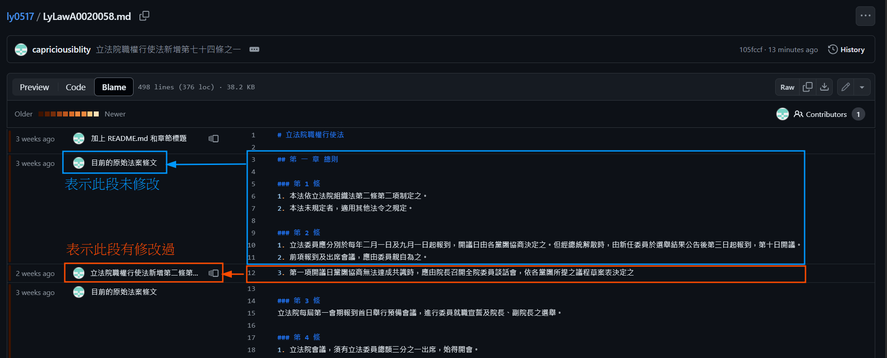

# 中華民國立法院，民國 113 年 5 月 17 日至 5 月 28 日會議，修正《立法院職權行使法》之內容

## 概述

本文收錄社群依照[ ivod 聽打](https://g0v.hackmd.io/S-FJ3CDERg2dXgqf_bjj8g)之內容，整理民國 113 年 5 月 17 日至 5 月 28 日立法院院會修正動議時提出之《立法院職權行使法》之修正，本專案保存修正前與修正後之法條以供比對。

## 使用方法

### 查看[逐條表決修正結果](https://github.com/capriciousiblity/ly0517/blame/vote/LyLawA0020058.md)

點擊上方「[逐條表決修正結果](https://github.com/capriciousiblity/ly0517/blame/vote/LyLawA0020058.md)」，可看逐條修改條之文，內文左欄若寫「目前的原始法案條文」則為未修正之內容，其餘為修正之內容。

### [修正前後差異比對](https://github.com/capriciousiblity/ly0517/commits/vote/)

點擊上方「[修正前後差異比對](https://github.com/capriciousiblity/ly0517/commits/vote/)字樣」連結，或右上角[X Commits](https://github.com/capriciousiblity/ly0517/commits/vote/)即可查看相關法條的修正前後比對。可查看此[教學動畫](img/HowToUse.gif)(約8MB)

### 完整法條瀏覽

點擊 [LyLawA0020058.md](LyLawA0020058.md) 即可查看 5/24 逐條表決修正後之「立法院職權行使法」
[LyLawC0000001_05.md](LyLawC0000001_05.md) 為刑法第 141 條修正後之條文（本分支未修改）。

### 分支 Branch 說明：

1. `vote`： 5 月 17 日 ~ 5 月 24 日逐條表決修正後之條文
1. `commit-240517`：依 5 月 17 日提出修正動議文件之條文
2. `main`：法律修正前之原文。

### 參考來源

- 法條原文為[全國法規資料庫](https://law.moj.gov.tw/Index.aspx)擷取之內容。
  - [立法院職權行使法之來源](https://law.moj.gov.tw/LawClass/LawAll.aspx?pcode=A0020058)
  - [刑法第 141 條妨害公務罪來源](https://law.moj.gov.tw/LawClass/LawAll.aspx?pcode=C0000001#141)
- 立法院網際網路多媒體隨選視訊(ivod)系統：[5 月 17 日](https://ivod.ly.gov.tw/Play/Full/1M/15925)、[5 月 21 日](https://ivod.ly.gov.tw/Demand/ListCommittee/ListVideo/19/2024-05-21)、[5 月 24 日](https://ivod.ly.gov.tw/Play/Full/1M/15945)
- [社群依照 ivod 聽打之內容](https://g0v.hackmd.io/S-FJ3CDERg2dXgqf_bjj8g)
